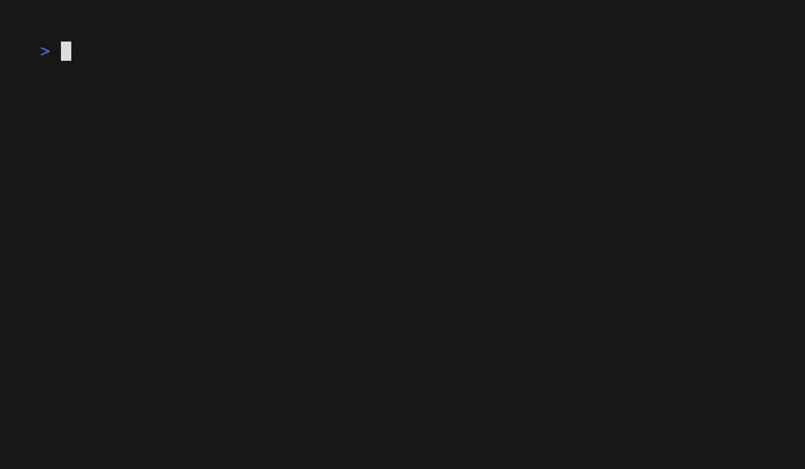

# Progoat [JA] 🐐

Progoatは、Progateに影響を受けた、LLMを利用したプログラミング学習のためのCLIツールです。ターミナル上でテーマを入力するだけで、スライドや実践内容を含む学習コース全体がAIによって生成され、コードを書くとLLMによって正誤判定が行われます。

> [!WARNING]
> AI生成コードをマシン上で実行します。実行前に必ずご確認ください。自己責任でご利用ください。


## デモ


## 機能

- **AIによる学習コース生成**: 学びたいことを入力するだけで、あらゆるトピックについて学習コース全体を作成できます。
- **対話式 CLI UI**: 美しくスムーズなユーザー体験を実現するために、[huh](https://github.com/charmbracelet/huh) を使用しています。
- **複数プロバイダ対応**: OpenAI, Gemini, Claudeをサポートしています。
- **体験型学習**: それぞれのレッスンがスライド、実践型タスク、定型コードを含んでおり、簡単に始められます。

## はじめに

### インストール

[Go](https://golang.org/dl/) がインストールされている必要があります。

```bash
go install github.com/minotto165/progoat@latest
```

もしくは、クローンして手動でビルドすることもできます。

```bash
git clone https://github.com/minotto165/progoat.git
cd progoat
go build -o progoat .
```

### 設定

コースを作成する前に、APIキーをセットアップする必要があります。

```bash
progoat config
```
これにより、LLMプロバイダを選択して APIキーを入力できる対話型フォームが開きます。

## 使用方法

### 1. コースを生成する
AIに何を学びたいか入力してください。
```bash
progoat generate
```
もしくは、引数としてプロンプトを追加してください。
```bash
progoat generate [Prompt] --length [short,medium,long]
```
プロンプトの例: *"goroutineとチャネルを使用した、Goの並行処理の基礎を学びたいです。"*

### 2. コースのリストを表示する
生成したすべてのコースを表示します。
```bash
progoat list
```

### 3. 学習を始める
コースの学習セッションを開始します。
```bash
progoat start
```
もしくは、引数としてコースIDを追加してください。
```bash
progoat start [CourseID]
```

### 4. 進捗を確認する (開発中)
どこまで進んだか確認しましょう。
```bash
progoat status
```

## 開発

ツールに貢献または変更したい場合は、次の手順に従ってください。

1. リポジトリをクローンする
2. 依存関係をインストールする: `go mod download`
3. CLIを実行する: `go run main.go`

## ライセンス

MITライセンスの下配布されています。さらなる情報は `LICENSE` を参照してください。

---

Made with ❤️ by [minotto](https://github.com/minotto165)
